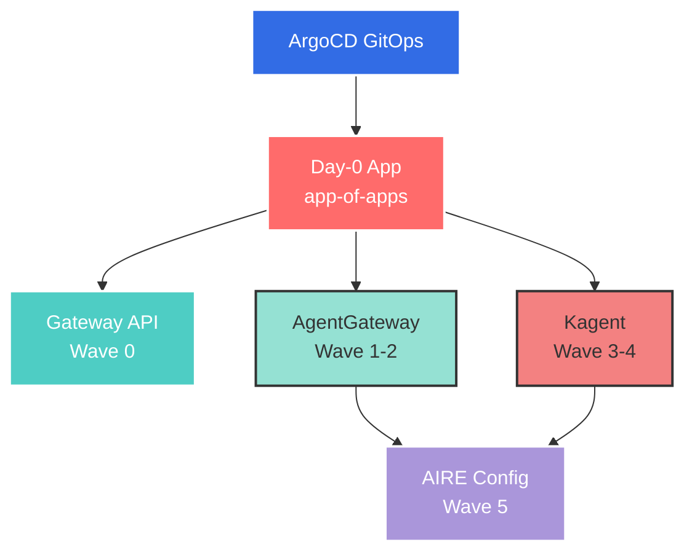
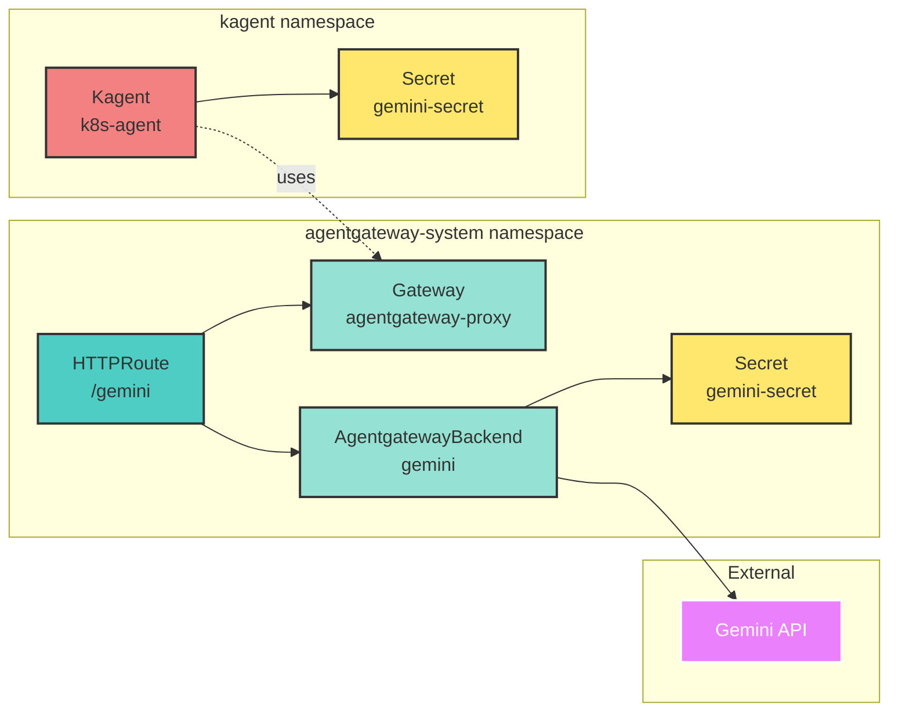
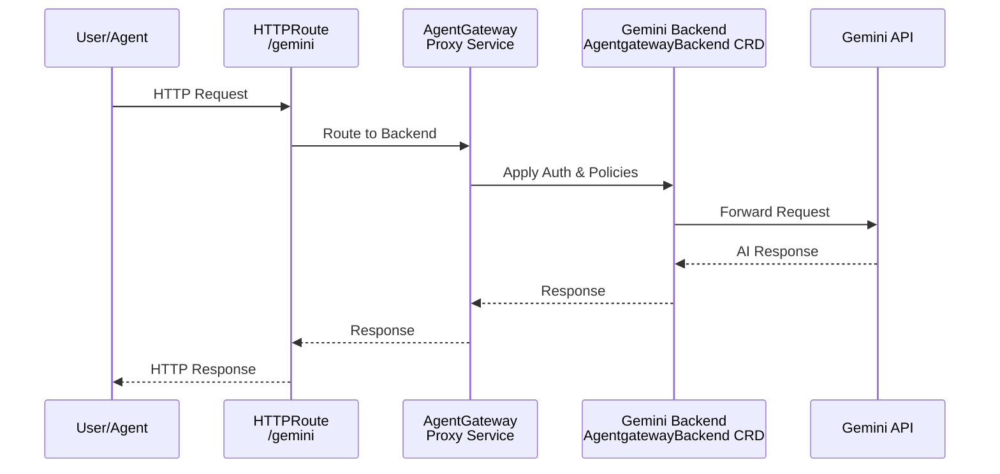

# AIRE Lab

AI Reliability Engineering (AIRE) Lab is a local Kubernetes environment for testing and developing AI-powered infrastructure automation. This lab provides a GitOps-driven platform for deploying and managing AI agents, API gateways, and backend integrations using industry-standard tools.

## Quick Start

### Prerequisites

- [Docker](https://docs.docker.com/get-docker/) (for Kind)
- [Kind](https://kind.sigs.k8s.io/docs/user/quick-start/#installation) v0.20.0+
- [kubectl](https://kubernetes.io/docs/tasks/tools/) v1.30.0+
- [Task](https://taskfile.dev/installation/) v3.0+
- [Gemini API Key](https://ai.google.dev/tutorials/setup)

### Installation

1. Clone the repository:
   ```bash
   git clone https://github.com/ikaliuzh/aire-agents.git
   cd aire-lab
   ```

2. Configure your Gemini API key:
   ```bash
   cp .example.env .env
   # Edit .env and add your Gemini API key
   ```

3. Bootstrap the lab environment:
   ```bash
   task up
   ```

This command will:
- Create a Kind cluster named `aire-lab`
- Install ArgoCD
- Create required namespaces
- Apply API secrets
- Deploy the app-of-apps pattern for automatic workload deployment

### Verify Installation

```bash
# Check ArgoCD applications
kubectl get applications -n argocd --context kind-aire-lab

# Check deployed workloads
kubectl get pods -A --context kind-aire-lab
```

### Teardown

```bash
task down
```

## Architecture Overview

The AIRE Lab uses a layered architecture with GitOps principles, orchestrated through ArgoCD's app-of-apps pattern.



### Component Architecture



### Components

#### 1. Gateway API (Wave 0)
- Kubernetes Gateway API CRDs
- Provides standard networking primitives for routing

#### 2. AgentGateway (Wave 1-2)
- **Purpose**: AI API gateway for routing requests to various AI backends
- **Namespace**: `agentgateway-system`
- **Version**: v1.0.0-rc.1
- **Features**:
  - Custom Resource Definitions for AI backend configuration
  - HTTP routing with Gateway API integration
  - Support for multiple AI providers (Gemini, OpenAI-compatible)
  - API key management via Kubernetes secrets

#### 3. Kagent (Wave 3-4)
- **Purpose**: AI-powered Kubernetes agent for infrastructure automation
- **Namespace**: `kagent`
- **Version**: 0.7.23
- **Features**:
  - Kubernetes operations automation
  - Integration with AgentGateway proxy
  - Support for multiple specialized agents:
    - k8s-agent (enabled by default)
    - kgateway-agent, istio-agent, promql-agent (optional)
    - argo-rollouts-agent, helm-agent (optional)
    - cilium-policy-agent, cilium-manager-agent, cilium-debug-agent (optional)

#### 4. AIRE Config (Wave 5)
- **Purpose**: Custom Helm chart deploying AI backend configurations
- **Namespace**: `agentgateway-system`
- **Configurations**:
  - Gateway resource definitions
  - AgentgatewayBackend CRDs for AI providers
  - HTTPRoute configurations for traffic routing

### Data Flow



## Usage

### Access AgentGateway

```bash
# Port-forward the gateway service
kubectl port-forward -n agentgateway-system svc/agentgateway-proxy 8080:80 --context kind-aire-lab

# Test the Gemini endpoint
curl -X POST http://localhost:8080/gemini \
  -H "Content-Type: application/json" \
  -d '{"prompt": "Hello, world!"}'
```

### Access Kagent UI

```bash
# Port-forward the Kagent UI service
kubectl port-forward -n kagent svc/kagent-ui 8082:8080 --context kind-aire-lab

# Open http://localhost:8082
```

The Kagent UI provides:
- Interactive chat interface with AI agents
- Real-time Kubernetes operations
- Agent execution history and logs
- Configuration management

### Access ArgoCD UI

```bash
# Get ArgoCD admin password
kubectl -n argocd get secret argocd-initial-admin-secret \
  -o jsonpath="{.data.password}" --context kind-aire-lab | base64 -d

# Port-forward ArgoCD server
kubectl port-forward svc/argocd-server -n argocd 8081:443 --context kind-aire-lab

# Open https://localhost:8081
# Username: admin
# Password: (from command above)
```
