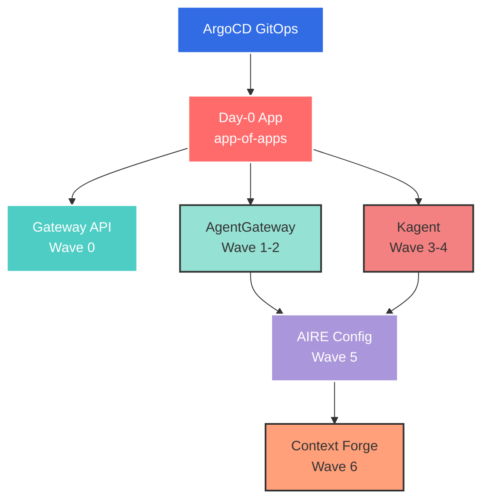
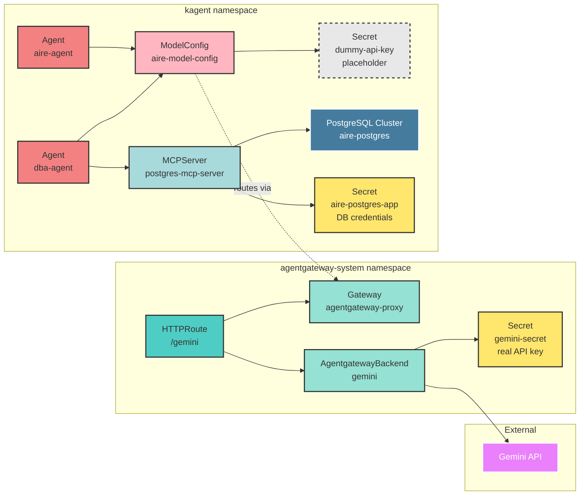
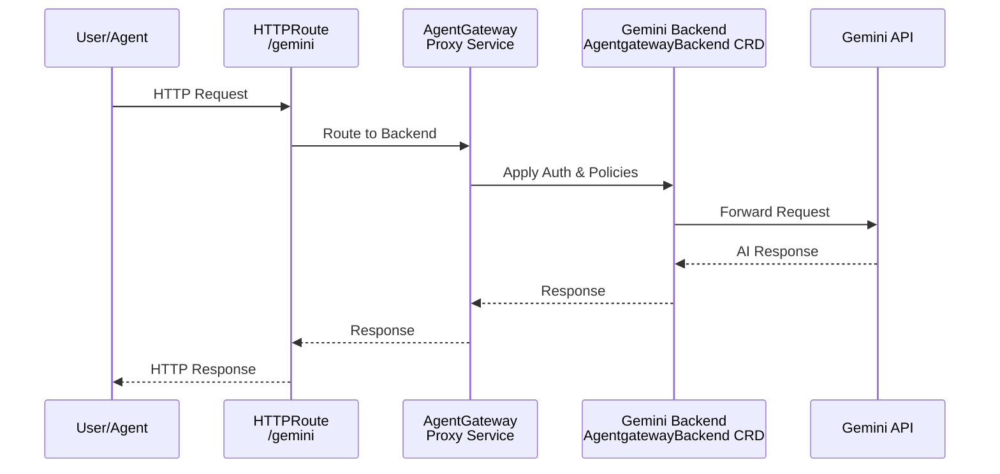
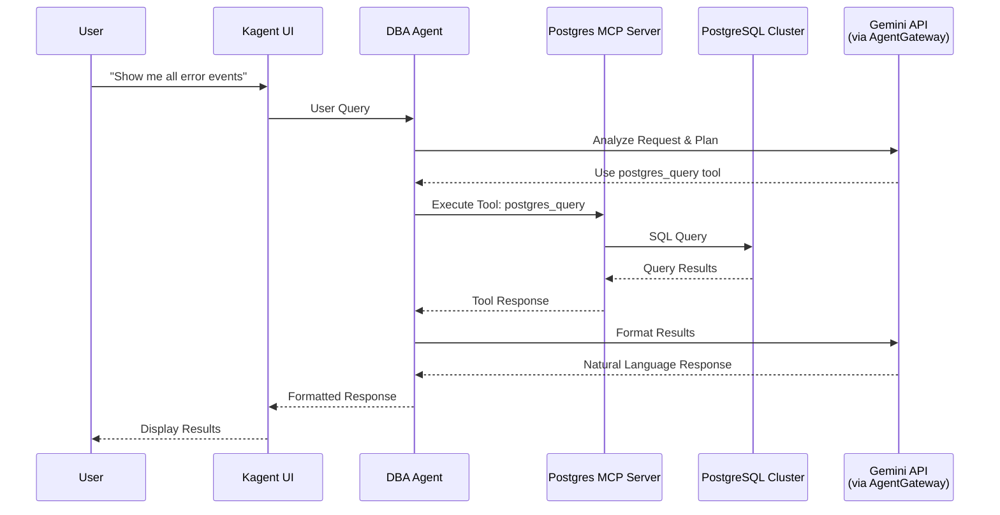

# AIRE Lab

AI Reliability Engineering (AIRE) Lab is a local Kubernetes environment for testing and developing AI-powered infrastructure automation. This lab provides a GitOps-driven platform for deploying and managing AI agents, API gateways, and backend integrations using industry-standard tools.

## Quick Start

### Prerequisites

- [Docker](https://docs.docker.com/get-docker/) (for Kind)
- [Kind](https://kind.sigs.k8s.io/docs/user/quick-start/#installation) v0.20.0+
- [kubectl](https://kubernetes.io/docs/tasks/tools/) v1.30.0+
- [Task](https://taskfile.dev/installation/) v3.0+
- [Gemini API Key](https://ai.google.dev/tutorials/setup)

### Installation

1. Clone the repository:
   ```bash
   git clone https://github.com/ikaliuzh/aire-agents.git
   cd aire-lab
   ```

2. Configure your Gemini API key:
   ```bash
   cp .example.env .env
   # Edit .env and add your Gemini API key
   ```

3. Bootstrap the lab environment:
   ```bash
   task up
   ```

This command will:
- Create a Kind cluster named `aire-lab`
- Install ArgoCD
- Create required namespaces
- Apply API secrets
- Deploy the app-of-apps pattern for automatic workload deployment
- Install CloudNativePG operator (via ArgoCD)
- Deploy PostgreSQL cluster with MCP server integration

### Verify Installation

```bash
# Check ArgoCD applications
kubectl get applications -n argocd --context kind-aire-lab

# Check deployed workloads
kubectl get pods -A --context kind-aire-lab
```

### Teardown

```bash
task down
```

## Architecture Overview

The AIRE Lab uses a layered architecture with GitOps principles, orchestrated through ArgoCD's app-of-apps pattern.



### Component Architecture



### Components

#### 1. Gateway API (Wave 0)
- Kubernetes Gateway API CRDs
- Provides standard networking primitives for routing

#### 2. AgentGateway (Wave 1-2)
- **Purpose**: AI API gateway for routing requests to various AI backends
- **Namespace**: `agentgateway-system`
- **Version**: v1.0.0-rc.1
- **Features**:
  - Custom Resource Definitions for AI backend configuration
  - HTTP routing with Gateway API integration
  - Support for multiple AI providers (Gemini, OpenAI-compatible)
  - API key management via Kubernetes secrets

#### 3. Kagent (Wave 3-4)
- **Purpose**: AI-powered Kubernetes agent framework for infrastructure automation
- **Namespace**: `kagent`
- **Version**: 0.7.23
- **Features**:
  - Kubernetes operations automation via AI agents
  - MCP (Model Context Protocol) server integration
  - Custom agent definitions via CRDs
  - Built-in tool servers for Kubernetes operations
  - Support for multiple specialized agents (k8s-agent, istio-agent, helm-agent, etc.)

#### 4. AIRE Config (Wave 5)
- **Purpose**: Custom Helm chart deploying AI backend configurations, databases, and custom agents
- **Namespaces**: `agentgateway-system`, `kagent`
- **Configurations**:
  - Gateway resource definitions
  - AgentgatewayBackend CRDs for AI providers (Gemini)
  - HTTPRoute configurations for traffic routing
  - ModelConfig for AIRE agents (auth-free, proxied through AgentGateway)
  - PostgreSQL cluster with CloudNativePG operator
  - MCP servers (Model Context Protocol) for specialized integrations
  - Custom AI agents (DBA, infrastructure reliability engineering)

#### 5. Context Forge (Wave 6)
- **Purpose**: IBM's MCP Gateway & Registry for centralized MCP server management and observability
- **Namespace**: `contextforge`
- **Version**: v1.0.0-RC2
- **Features**:
  - MCP server federation and registry
  - A2A (Agent-to-Agent) protocol support
  - API Gateway with rate limiting, auth, retries
  - Admin UI for real-time management
  - OpenTelemetry observability (Phoenix, Jaeger, Zipkin)
  - Multi-tenancy with user/team RBAC
  - Tool composition via virtual servers
  - gRPC-to-MCP translation

### Data Flow

#### AI Request Flow (via AgentGateway)


#### DBA Agent Database Operations Flow


### Authentication Architecture

AgentGateway centralizes authentication to upstream AI providers. AIRE agents use a dummy API key (required by the OpenAI SDK) and route all requests through AgentGateway, which handles actual authentication:

```yaml
# ModelConfig uses placeholder credentials
spec:
  provider: OpenAI
  model: gemini-3-flash-preview
  apiKeySecret: dummy-api-key  # Placeholder for SDK compatibility
  openAI:
    baseUrl: http://agentgateway-proxy.agentgateway-system/gemini

# AgentGateway holds real credentials
spec:
  policies:
    auth:
      secretRef:
        name: gemini-secret  # Real API key here
```


## MCP Servers & AI Agents

### PostgreSQL Database with DBA Agent

For testing and demonstration purposes, the AIRE Lab includes a PostgreSQL database cluster managed by the CloudNativePG operator, integrated with the **CrystalDBA Postgres MCP Server** for advanced database operations.

#### PostgreSQL Cluster
- **Namespace**: `kagent`
- **Cluster Name**: `aire-postgres`
- **Database**: `airedb`
- **Operator**: CloudNativePG (CNPG)
- **Features**:
  - High-availability PostgreSQL 17
  - Automated backups and replication
  - Extensions: `pg_stat_statements` for query analytics
  - Sample `application_events` table with test data

#### CrystalDBA Postgres MCP Server
- **Image**: `crystaldba/postgres-mcp:latest`
- **Repository**: [github.com/crystaldba/postgres-mcp](https://github.com/crystaldba/postgres-mcp)
- **Capabilities**:
  - **Database Health Analysis**: Index integrity, connection utilization, buffer cache performance, vacuum status
  - **AI-Powered Index Tuning**: Industrial algorithms for optimal indexing strategies
  - **Query Optimization**: EXPLAIN plans and query execution analysis
  - **Schema Intelligence**: Contextual SQL generation based on database understanding
  - **Safe Execution**: Configurable access modes (unrestricted/restricted)

#### DBA Agent
The AI Database Administrator agent specializes in PostgreSQL operations and provides:

- **Query Operations**: Execute SQL queries, inspect schemas, manage databases
- **Performance Analysis**: Query optimization, execution plan analysis, index recommendations
- **Health Monitoring**: Database health checks, connection pool monitoring
- **Schema Management**: Table inspection, index analysis, schema modifications
- **Data Analysis**: Analytical queries and insights generation
- **Maintenance**: VACUUM, ANALYZE, and other maintenance operations

**Available Tools**:
- `postgres_query` - Execute SQL queries
- `postgres_explain_query` - Get query execution plans
- `postgres_list_databases` - List all databases
- `postgres_list_tables` - List tables in a database
- `postgres_describe_table` - View table schema
- `postgres_table_stats` - Get table statistics
- `postgres_list_indexes` - List indexes on a table
- `postgres_create_database` - Create new databases
- `postgres_vacuum_analyze` - Update statistics and reclaim space
- Plus Kubernetes tools for cluster inspection

**Example Interactions**:
```bash
# Via Kagent UI (port 8082)
"Show me the schema of the application_events table"
"Find all error events from the last 24 hours"
"This query is slow, can you optimize it?"
"What are the most common event types?"
```

#### ADK Root Agent (A2A Integration)

The ADK Root Agent is a Google ADK-based agent that demonstrates **Agent-to-Agent (A2A) communication** capabilities. It serves as a database schema manager that can delegate complex database operations to the DBA agent.

**Built with**:
- **Google ADK** (Agent Development Kit) v1.28.1
- **A2A Protocol** - JSON-RPC 2.0 over HTTP for agent-to-agent communication
- **FastAPI + Uvicorn** - REST API server for A2A endpoints
- **Pure Orchestration** - No direct database access, delegates everything via A2A

**Key Capabilities**:
- **Database Schema Management**: Create databases with predefined schemas by delegating to DBA agent
- **A2A Delegation**: ALL database operations delegated to the DBA agent (queries, analysis, optimization, maintenance)
- **Clean Architecture**: Pure orchestrator with no database dependencies
- **Production Ready**: Health checks, logging, RBAC, resource limits

**Architecture** (Pure A2A + AgentGateway):
```
┌─────────────────────┐
│   ADK Root Agent    │  <-- Google ADK (Python)
│   (Deployment)      │      FastAPI/Uvicorn
│                     │      Port 8080
│   NO DB ACCESS      │      Pure Orchestrator
└──────────┬──────────┘
           │
           ├─────────────────────┐
           │ A2A (Database ops)  │ OpenAI API (AI requests)
           │                     │
           ▼                     ▼
┌─────────────────────┐   ┌─────────────────────┐
│  DBA Agent          │   │  AgentGateway       │
│  (Agent CRD)        │   │  Proxy              │
│                     │   │                     │
│  A2A Skills:        │   │  Centralized Auth   │
│  - Queries          │   │  for Gemini API     │
│  - Schema Creation  │   │                     │
│  - Analysis         │   └──────────┬──────────┘
│  - Optimization     │              │
│  - Maintenance      │              ▼
│         │           │        Gemini API
│         ▼           │
│  PostgreSQL MCP     │
│  Server             │
└─────────────────────┘
```

**Deployment**:
- **Namespace**: `aire-lab`
- **Name**: `adk-root-agent`
- **Service**: `adk-root-agent.aire-lab.svc.cluster.local:8080`
- **Image**: `ikaliuzh/aire-agent-root:latest`

**Available DBA Agent Skills** (via A2A):
- `database-queries` - Execute SQL queries and retrieve data
- `schema-inspection` - Inspect database schemas and structures
- `performance-optimization` - Analyze and optimize query performance
- `database-maintenance` - Perform VACUUM and ANALYZE operations
- `data-analysis` - Analyze data patterns and generate insights

**Example Workflows**:
```bash
# 1. Create a new database with predefined schema
"Create a test database called 'metrics_db' with the default schema"

# 2. Delegate to DBA agent for analysis
"Ask the DBA agent to analyze the table statistics for metrics_db"

# 3. Combined workflow
"Create a new database, populate it with sample data, and ask the DBA agent for performance insights"
```

**Building and Deploying**:
```bash
# Build the Docker image (uses Poetry)
task agent:build

# Push to Docker Hub
task agent:push VERSION=v1.0.0

# Run tests locally
task agent:test

# Run all checks
task agent:check-all

# Deploy via Helm (enabled by default in values.yaml)
kubectl get deployment -n kagent adk-root-agent
kubectl get svc -n kagent adk-root-agent
```

**Local Development** (requires [Poetry](https://python-poetry.org/)):
```bash
# All tasks available with agent: prefix
task agent:install      # Install dependencies
task agent:test         # Run tests
task agent:test-cov     # Tests with coverage
task agent:lint         # Linting
task agent:format       # Format code
task agent:type-check   # Type checking
task agent:run          # Run agent locally

# Or use poetry directly
cd agents/adk-root
poetry install
poetry run pytest
```

**Configuration** (in `chart/values.yaml`):
```yaml
agents:
  adkRoot:
    enabled: true
    name: adk-root-agent
    namespace: kagent
    replicas: 1
    image:
      repository: ikaliuzh/aire-agent-root
      tag: latest
      pullPolicy: IfNotPresent
    resources:
      requests:
        cpu: 100m
        memory: 256Mi
      limits:
        cpu: 500m
        memory: 512Mi
```

**Testing A2A Communication**:
```bash
# Port-forward to the ADK agent
kubectl port-forward -n kagent svc/adk-root-agent 8080:8080

# Query the agent via A2A protocol
curl -X POST http://localhost:8080/invoke \
  -H "Content-Type: application/json" \
  -d '{
    "prompt": "Create a test database and analyze its performance"
  }'
```

**Development**:
See [agents/adk-root/README.md](agents/adk-root/README.md) for detailed development documentation, including:
- Local development setup
- Adding custom schemas
- Extending A2A capabilities
- Unit testing
- Troubleshooting

### MCP Server Architecture

MCP (Model Context Protocol) servers provide specialized capabilities to AI agents. The AIRE Lab uses the Kagent MCPServer CRD to deploy and manage these servers:

```yaml
apiVersion: kagent.dev/v1alpha1
kind: MCPServer
metadata:
  name: postgres-mcp-server
  namespace: kagent
spec:
  transportType: http
  deployment:
    image: crystaldba/postgres-mcp:latest
    # Shell wrapper for secure credential injection
    cmd: "/wrapper/entrypoint.sh"
    args:
    - --access-mode=unrestricted
    volumeMounts:
      # Mount credentials from CNPG-managed secrets
    - name: postgres-secret
      mountPath: /secrets/postgres
```

**Key Features**:
- HTTP transport for Kubernetes-native integration
- Secure credential management via mounted secrets
- Shell wrapper pattern for dynamic DATABASE_URI construction
- Auto-discovery of available tools (no manual tool definitions needed)

### Agent-to-MCP Integration

Agents reference MCP servers declaratively in their configuration:

```yaml
apiVersion: kagent.dev/v1alpha2
kind: Agent
metadata:
  name: dba-agent
spec:
  type: Declarative
  declarative:
    tools:
    - type: McpServer
      mcpServer:
        apiGroup: kagent.dev
        kind: MCPServer
        name: postgres-mcp-server
        toolNames:
        - postgres_query
        - postgres_explain_query
        # ... additional tools
```

This architecture provides:
- **Separation of Concerns**: MCP servers handle domain logic, agents orchestrate interactions
- **Reusability**: Multiple agents can use the same MCP server
- **Security**: Credentials isolated in Kubernetes secrets
- **Observability**: Kubernetes-native monitoring and logging

## Usage

### Access PostgreSQL Database

```bash
# Get database credentials
kubectl get secret aire-postgres-app -n kagent -o jsonpath='{.data.password}' | base64 -d

# Port-forward PostgreSQL
kubectl port-forward -n kagent svc/aire-postgres-rw 5432:5432 --context kind-aire-lab

# Connect with psql
psql postgresql://aire:<password>@localhost:5432/airedb
```

### Interact with DBA Agent

```bash
# Port-forward Kagent UI
kubectl port-forward -n kagent svc/kagent-ui 8082:8080 --context kind-aire-lab

# Open http://localhost:8082 and select the "dba-agent"
# Example queries:
# - "Show me all tables in the database"
# - "What events have been logged today?"
# - "Analyze the performance of this query: SELECT * FROM application_events WHERE severity='error'"
```

### Access AgentGateway

```bash
# Port-forward the gateway service
kubectl port-forward -n agentgateway-system svc/agentgateway-proxy 8080:80 --context kind-aire-lab

# Test the Gemini endpoint
curl -X POST http://localhost:8080/gemini \
  -H "Content-Type: application/json" \
  -d '{"prompt": "Hello, world!"}'
```

### Access Kagent UI

```bash
# Port-forward the Kagent UI service
kubectl port-forward -n kagent svc/kagent-ui 8082:8080 --context kind-aire-lab

# Open http://localhost:8082
```

The Kagent UI provides:
- Interactive chat interface with AI agents
- Real-time Kubernetes operations
- Agent execution history and logs
- Configuration management

### Access Context Forge

```bash
# Port-forward the Context Forge service (or use task)
task contextforge-ui
# OR manually:
# kubectl port-forward -n contextforge svc/contextforge-mcp-context-forge 4444:80 --context kind-aire-lab

# Open http://localhost:4444/admin
# Login: admin@aire-lab.local / changeme123

# Generate API token for CLI access
task contextforge-token
```

Context Forge provides:
- **Admin UI**: Web-based management interface
- **MCP Server Registry**: Register and manage MCP servers
- **Tool Catalog**: Browse available tools across all MCP servers
- **Virtual Servers**: Create custom tool bundles
- **API Gateway**: Centralized routing and authentication
- **Observability**: Request tracing and metrics
- **Multi-tenancy**: User and team management

**Quick API Test**:
```bash
# Export token from task contextforge-token
export CONTEXTFORGE_TOKEN="your-token-here"

# Test health
curl -H "Authorization: Bearer $CONTEXTFORGE_TOKEN" http://localhost:4444/health | jq

# List available tools
curl -H "Authorization: Bearer $CONTEXTFORGE_TOKEN" http://localhost:4444/tools | jq

# Register postgres-mcp-server
curl -X POST http://localhost:4444/gateways \
  -H "Authorization: Bearer $CONTEXTFORGE_TOKEN" \
  -H "Content-Type: application/json" \
  -d '{
    "name": "postgres_mcp",
    "url": "http://postgres-mcp-server.kagent.svc.cluster.local:80/mcp"
  }'
```

See [workloads/contextforge/README.md](workloads/contextforge/README.md) for detailed usage.

### Access ArgoCD UI

```bash
# Get ArgoCD admin password
kubectl -n argocd get secret argocd-initial-admin-secret \
  -o jsonpath="{.data.password}" --context kind-aire-lab | base64 -d

# Port-forward ArgoCD server
kubectl port-forward svc/argocd-server -n argocd 8081:443 --context kind-aire-lab

# Open https://localhost:8081
# Username: admin
# Password: (from command above)
```
