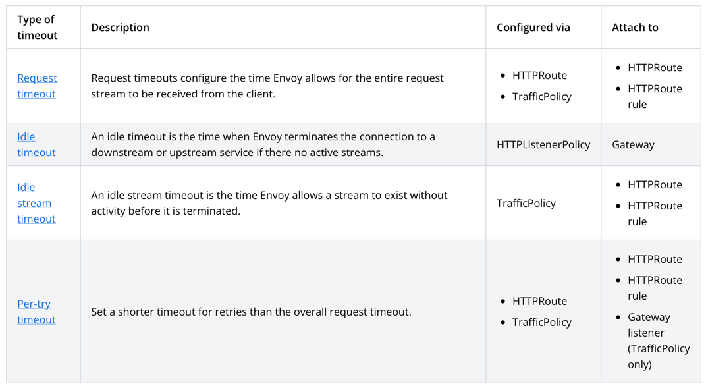

# Vin's Questions — AI Infrastructure Setup Review

### 1. How could we handle 'agent got stuck' scenarios?

Handle this at three layers: **agent runtime**, **gateway**, and **workflow state**. At runtime, enforce
`max_steps`, `max_tool_calls` (this could be granular enough to have a per tool limit or limit for 
set of tool name and list of arguments), and granular timeouts (per tool call, per llm call, API calls, etc.). 
At the gateway layer, use  request/per-try timeouts, retries only for safe failure classes, and circuit breakers to prevent infinite
waiting on bad upstreams. For long-running agents, add checkpointing so a stuck run can be aborted and
resumed instead of hanging forever, introduce explicit cancel / terminate. Also, it could be beneficial to
have a dead-letter queue for runs that got stuck or failed, so they can be inspected and retried by developers.

- https://kgateway.dev/docs/envoy/main/resiliency/timeouts/about/
- https://docs.solo.io/agentgateway/2.2.x/security/rate-limit-http/
- https://agentgateway.dev/docs/standalone/latest/about/introduction/

### 2. Any automatic timeout/circuit breaker patterns coming out from this framework?

**Yes, at the gateway layer.** Kgateway provides request timeouts, per-try timeouts, retries, circuit
breakers, and passive outlier detection. That gives a fail-fast behavior for flaky or overloaded model
backends. But it does **not** replace agent-level loop protection, so it is still needed to set explicit limits in
the agent runtime.

- https://kgateway.dev/docs/envoy/main/resiliency/timeouts/about/
- https://kgateway.dev/docs/

### 3. How does kgateway handle model failover?

Kgateway/agentgateway uses **priority-based failover**. Traffic is sent to the preferred model/backend
first, and if it fails or degrades, traffic is shifted to a lower-priority backend. Inside a priority
tier it uses load balancing; 

- https://docs.solo.io/gateway/2.0.x/ai/llm/failover/
- https://kgateway.dev/docs/

### 4. Can we automatically switch from OpenAI to Claude to local model?

**Yes.** Agentgateway sits in front of multiple providers and exposes a **unified OpenAI-compatible API**.
That means we can route or fail over from OpenAI to Anthropic and then to a local OpenAI-compatible
backend such as vLLM or Ollama, with the application still speaking one API shape.

- https://agentgateway.dev/docs/standalone/latest/tutorials/llm-gateway/
- https://agentgateway.dev/docs/standalone/latest/about/introduction/
- https://agentgateway.dev/docs/kubernetes/main/llm/providers/openai/

### 5. Could we seamlessly handle the response formats from these providers?

**Mostly yes, but not perfectly.** Agentgateway can normalize and even translate between provider APIs,
but translation mode only guarantees fields the gateway understands. Native passthrough is safer for
provider-specific features; translated mode is good for portability but may lag on newly introduced
vendor fields.

- https://docs.solo.io/agentgateway/2.2.x/llm/about/
- https://agentgateway.dev/docs/standalone/latest/about/introduction/

### 6. Can we version the agents built from kagent?

**Yes operationally, but mostly through Kubernetes/GitOps patterns.** Kagent agents are Kubernetes
resources, so versioning is typically done via **CR manifests, image tags/digests, and config versions**.
In practice, the agent version should be treated as the tuple of prompt/tool config + container image +
CR spec.

- https://kagent.dev/docs/kagent/resources/api-ref
- https://docs.solo.io/kagent-enterprise/docs/main/reference/api/kagent/
- https://github.com/kagent-dev/kagent

### 7. Any blue/green or canary deployment patterns for agents?

**Yes, but not as a special agent-native deployment primitive.** Use normal Kubernetes delivery patterns:
deploy a new agent revision, expose each revision behind separate routes/services, and shift traffic with
**HTTPRoute traffic splitting** or **Argo Rollouts**. That gives you blue/green and canary behavior for
agents just like any other service.

- https://kgateway.dev/docs/envoy/main/integrations/argo/

### 8. What's the fastmcp-python framework mentioned?

It is **FastMCP**, a Python framework for building **MCP servers, clients, and applications**. It wraps
Python functions as MCP tools/resources/prompts and handles schema generation, validation, and transport
details so you can expose tools quickly.

- https://gofastmcp.com/getting-started/welcome

### 9. Is it the easiest path to MCP?

For **Python**, probably **yes**. FastMCP is currently the most ergonomic path from prototype to usable
MCP service.

- https://gofastmcp.com/v2/getting-started/welcome

### 10. About finops: how much control I can have?

You can get **strong control** at the gateway layer: token accounting, per-key or per-route budgets,
rate limiting, cost estimation from token metrics, telemetry export to Prometheus/OpenTelemetry, and
policy enforcement. This is enough for showback/chargeback, budget caps, and alerting.

- https://agentgateway.dev/docs/kubernetes/main/llm/cost-tracking/
- https://agentgateway.dev/docs/kubernetes/2.2.x/llm/budget-limits/
- https://agentgateway.dev/docs/kubernetes/latest/llm/observability/

### 11. Token level / per agent level

**Token-level control is native.** **Per-agent control is also possible** if each agent is given its own
route, API key, header identity, or JWT-derived key. Then the gateway can meter and limit token usage
per agent boundary, not only globally.

- https://agentgateway.dev/docs/kubernetes/2.2.x/llm/api-keys/
- https://agentgateway.dev/docs/kubernetes/2.2.x/llm/virtual-keys/
- https://agentgateway.dev/docs/kubernetes/main/llm/cost-tracking/

### 12. Can I implement custom cost controls?

**Yes.** The standard pattern is to compose API key auth, token-based rate limits, per-route policies,
 and observability. That lets you build custom controls such as “different budgets by
team”, “block expensive model on weekends”, or “cap daily spend per API key”.

- https://agentgateway.dev/docs/kubernetes/2.2.x/llm/budget-limits/
- https://agentgateway.dev/docs/kubernetes/2.2.x/llm/rate-limit

### 13. Per-agent budgets or depth of token limits

**Per-agent token budgets: yes.** **Reasoning depth / tool-call depth: not at the gateway.** Gateway
budgets are about tokens, requests, and keys. If we want to cap “agent may do only 8 steps” or “max 3
recursive tool loops”, that must be enforced in the agent runtime/orchestrator.

- https://agentgateway.dev/docs/kubernetes/2.2.x/llm/budget-limits/
- https://agentgateway.dev/docs/kubernetes/2.2.x/llm/rate-limit
- https://docs.solo.io/agentgateway/2.2.x/llm/about/

### 14. vLLM suitable for agents with many back and forth tool calls, or is it better for single shot inference?

**Suitable, but not ideal by itself for heavily agentic pause/resume workloads.** vLLM is strong for
throughput and has **automatic prefix caching**, which helps repeated multi-turn prompts. However, agent
workloads with many tool pauses can reduce cache locality and increase KV cache churn, so performance
may degrade versus continuous chat or single-shot inference.

- https://docs.vllm.ai/en/stable/design/prefix_caching/
- https://github.com/vllm-project/vllm/issues/8333

### 15. llm-d's scheduler - helps when agents makes 15 llms calls?

**Yes.** This is one of its main advantages. Llm-d’s scheduler is designed to make smarter routing
decisions using **prefix/KV-cache awareness** and inference-aware scheduling, so a chain of many related
LLM calls is more likely to land where cache reuse is preserved. That matters a lot for agent workloads
with repeated related context.

- https://github.com/llm-d/llm-d
- https://github.com/llm-d/llm-d/blob/main/guides/precise-prefix-cache-aware/README.md
- https://llm-d.ai/blog/kvcache-wins-you-can-see
